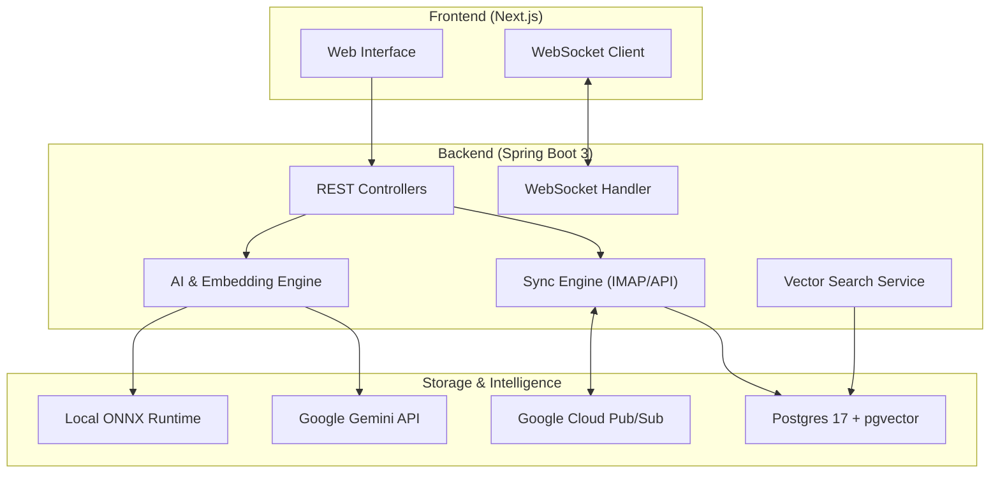
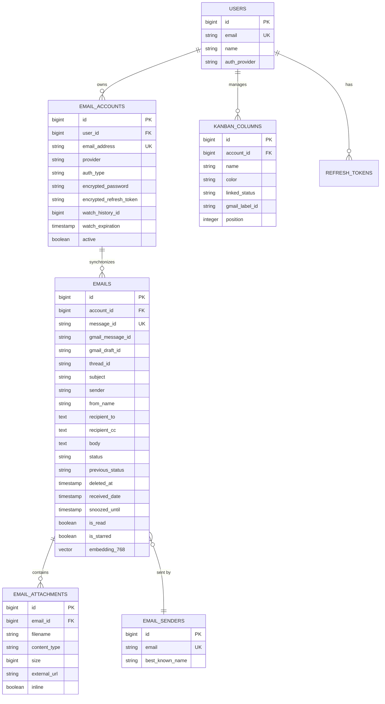

# MailBoard v1.0.0 - AI-Powered Email Management Platform

MailBoard is a full-featured, AI-powered email management platform built with **Java 21** and **Spring Boot 3**. It integrates directly with **Gmail** via OAuth 2.0, IMAP, and the Gmail API, providing intelligent email triage through a dynamic **Kanban Board**, **AI Summarization** (Gemini), and **Semantic Search** (pgvector).

> [!NOTE]
> This is the **Backend** repository (REST API + PostgreSQL + pgvector).
> The **Frontend** (Next.js + TypeScript) is managed in a separate repository: [mailboard-frontend](https://github.com/tlavu2004/mailboard-frontend)

---

## Table of Contents

- [Key Features](#key-features)
- [Architecture](#architecture)
- [Database Schema](#database-schema)
- [Tech Stack](#tech-stack)
- [API Overview](#api-overview)
- [Getting Started](#getting-started)
- [Environment Variables](#environment-variables)
- [Deployment](#deployment)
- [Authors](#authors)
- [License](#license)

---

## Key Features

### Gmail Integration & Sync Engine
Full bidirectional integration with Gmail via OAuth 2.0, optimized for stability:
- **IMAP Incremental Sync**: High-performance sync using UID tracking to fetch only new/changed emails.
- **Gmail Watch API**: Real-time push notifications via Google Cloud Pub/Sub — new emails appear instantly in the UI.
- **Bulk Operations**: Optimized bulk move, bulk delete, and "Restore All" functionality for efficient mailbox management.
- **Label Synchronization**: Automatic mapping between Gmail labels and local status/Kanban columns.

### Intelligent Kanban Board
A professional triage system designed for productivity:
- **Dynamic Workflow**: Create and manage custom columns (e.g., "To Do", "Waiting", "Done") with Gmail label backing.
- **Smart Triage**: Drag-and-drop emails between columns to automatically update their Gmail labels.
- **Snooze Support**: Postpone emails to a future date/time; they automatically return to the Inbox via a background scheduler.

### AI Intelligence (Gemini)
State-of-the-art AI processing integrated into the core workflow:
- **Email Summarization**: One-click summaries generated by Google Gemini, with a local extractive fallback.
- **Composite Embedding Service**: A robust dual-layer system that generates 768-dimensional embeddings using Gemini API (primary) or local ONNX models (fallback).
- **Semantic Understanding**: Emails are indexed in a vector space for conceptual search, not just keyword matching.

### Advanced Search
- **Fuzzy Text Search**: Typo-tolerant matching using PostgreSQL `pg_trgm`.
- **Vector Search**: Semantic conceptual search powered by `pgvector` and HNSW indexing.
- **Real-time Suggestions**: Instant type-ahead suggestions for contacts and subjects.

### Authentication & Security
- **Google OAuth 2.0**: Single Sign-On via Google with Authorization Code flow.
- **JWT Tokens**: Access token (in-memory) + Refresh token (persistent) with automatic rotation.
- **AES Encryption**: Sensitive credentials (Gmail OAuth tokens) are encrypted at rest.

---

## Architecture


*Note: [Insert actual architecture diagram here - screenshot_architecture.png]*

The platform is built as a **Modular Monolith**, ensuring a balance between development speed and clean domain separation.



---

## Database Schema


*Note: [Insert actual ERD screenshot here - screenshot_database_erd.png]*



- **Vector Indexes**: HNSW indexes on `embedding_768` and `embedding_384` for sub-second semantic search.
- **Trigram Indexes**: GIN trigram indexes on `subject` and `sender` for fast fuzzy text matching.
- **Migrations**: 8 Flyway migrations managing consolidated schema structure from extensions to kanban columns.

---

## Tech Stack

| Category | Technology |
| :--- | :--- |
| **Language** | Java 21 |
| **Framework** | Spring Boot 3.5.8 |
| **Security** | Spring Security + JWT (jjwt 0.13.0) + Google OAuth 2.0 |
| **Database** | PostgreSQL 17 (pgvector + pg_trgm) |
| **ORM** | Spring Data JPA / Hibernate |
| **DB Migration** | Flyway |
| **Object Mapping** | MapStruct 1.6.3 + Lombok |
| **Email** | Eclipse Angus Mail (IMAP + SMTP via XOAUTH2) |
| **AI - Cloud** | Google Gemini API (Summarization + Embeddings) |
| **AI - Local** | ONNX Runtime 1.18.0 + DJL Tokenizers |
| **Vector Search** | pgvector 0.1.6 (Cosine Distance, HNSW) |
| **Real-Time** | Spring WebSocket |
| **Push Notifications** | Google Cloud Pub/Sub (Gmail Watch API) |
| **API Docs** | SpringDoc OpenAPI 2.8 (Swagger UI) |
| **Containerization** | Docker (multi-stage build) + Docker Compose |
| **Deployment** | Render (backend) + Vercel (frontend) |

---

## API Overview

Base path: `/api/v1`

| Group | Prefix | Description |
| :--- | :--- | :--- |
| **Authentication** | `/auth` | Google OAuth login, token refresh, logout, profile |
| **Mailboxes** | `/mailboxes` | List mailboxes (labels), get emails by mailbox with pagination |
| **Emails** | `/emails` | Get detail, search, send, reply, modify labels, sync, download attachments |
| **Search** | `/search` | Fuzzy search, semantic search, auto-suggestions, embedding generation |
| **Kanban** | `/kanban` | CRUD columns, update email status, snooze/unsnooze |
| **Statistics** | `/stats` | Aggregated email statistics (total, unread, starred, sent) |
| **Gmail Pub/Sub** | `/gmail/pubsub` | Webhook receiver for Gmail push notifications |
| **Dashboard** | `/dashboard` | Legacy compatibility endpoints for the frontend |

Interactive API documentation is available at:
```
http://localhost:8080/swagger-ui/index.html
```

---

## Getting Started

### Prerequisites
- **Java 21+**
- **Maven 3.9+**
- **Docker & Docker Compose** (for PostgreSQL with pgvector)

### Option 1: Full Infrastructure Bundle (Recommended)

Spin up PostgreSQL (with pgvector), ngrok (for Gmail Pub/Sub), and the Spring Boot application together:

```bash
# 1. Clone the repository
git clone https://github.com/tlavu2004/mailboard-backend.git
cd mailboard-backend

# 2. Configure environment
cp .env.example .env
# Edit .env and fill in required values (see Environment Variables section)

# 3. Start everything
docker compose up -d
```

The app will be available at `http://localhost:8080`.

### Option 2: Local Development (Database in Docker)

Run only PostgreSQL in Docker, and the application natively:

```bash
# 1. Start database (pgvector-enabled PostgreSQL)
docker compose up -d postgresql

# 2. Configure environment
cp .env.example .env

# 3. Run the application
mvn spring-boot:run
```

---

## Environment Variables

Copy `.env.example` to `.env` and fill in the required values.

> [!IMPORTANT]
> Always ensure your `.env` file is in the root directory before running the application or Docker.

### Required

| Variable | Description |
| :--- | :--- |
| `DB_URL` | PostgreSQL JDBC URL (default: `jdbc:postgresql://localhost:5432/mailboard`) |
| `DB_USERNAME` | Database username (default: `postgres`) |
| `DB_PASSWORD` | Database password (default: `postgres`) |
| `JWT_SECRET` | Secret key for signing JWT tokens. Generate with `openssl rand -base64 32`. |
| `GOOGLE_CLIENT_ID` | Google OAuth client ID from [Google Cloud Console](https://console.cloud.google.com/) |
| `GOOGLE_CLIENT_SECRET` | Google OAuth client secret |
| `ENCRYPTION_AES_KEY` | AES-256 key for encrypting OAuth tokens at rest. Generate with `openssl rand -base64 32`. |

### Optional

| Variable | Description | Default |
| :--- | :--- | :--- |
| `SPRING_PROFILES_ACTIVE` | Active Spring profile | `dev` |
| `SERVER_PORT` | Server port | `8080` |
| `JWT_ACCESS_EXPIRATION` | Access token TTL (ms) | `86400000` (24h) |
| `JWT_REFRESH_EXPIRATION` | Refresh token TTL (ms) | `604800000` (7 days) |
| `CORS_ALLOWED_ORIGIN_1` | Frontend URL for CORS | `http://localhost` |
| `CORS_ALLOWED_ORIGIN_2` | Additional CORS origin | `http://localhost:3000` |

### AI & Search

| Variable | Description | Default |
| :--- | :--- | :--- |
| `GEMINI_API_KEY` | Google Gemini API key(s), comma-separated for rotation | — |
| `GEMINI_EMBEDDING_MODEL` | Embedding model name | `gemini-embedding-001` |
| `GEMINI_CHAT_MODEL` | Chat/summarization model name | `gemini-2.5-flash` |
| `APP_EMBEDDING_LOCAL_ENABLED` | Enable local ONNX fallback | `true` |

### Gmail Push Notifications

| Variable | Description | Default |
| :--- | :--- | :--- |
| `GMAIL_PUBSUB_TOPIC` | Google Cloud Pub/Sub topic | `projects/{PROJECT_ID}/topics/gmail-notifications` |
| `NGROK_AUTHTOKEN` | Ngrok auth token for local Pub/Sub webhook tunnel | — |

---

## Deployment

### Backend — Render

The project includes a `render.yaml` Blueprint and a multi-stage `Dockerfile` optimized for Render's free tier (512MB RAM):

```dockerfile
ENTRYPOINT ["java", "-XX:MaxRAMPercentage=75.0", "-XX:ActiveProcessorCount=1", "-jar", "app.jar"]
```

Set `SPRING_PROFILES_ACTIVE=prod` and configure all required environment variables in Render's dashboard. The production profile automatically disables the local ONNX model to conserve memory.

### Frontend — Vercel

The frontend repository includes a `vercel.json` for deployment to Vercel. See the [frontend README](https://github.com/tlavu2004/mailboard-frontend) for details.

---

## Authors

| Student ID | Full Name | Github |
| :--- | :--- | :--- |
| **22120303** | Mai Xuân Quý | [m-xuanquy](https://github.com/m-xuanquy) |
| **22120430** | Lê Hoàng Việt | [Keruedu](https://github.com/Keruedu) |
| **22120443** | Trương Lê Anh Vũ | [tlavu2004](https://github.com/tlavu2004) |

---

## Contribution

1. Fork the repository.
2. Create a feature branch (`git checkout -b feature/AmazingFeature`).
3. Commit your changes (`git commit -m 'Add some AmazingFeature'`).
4. Push to the branch (`git push origin feature/AmazingFeature`).
5. Open a Pull Request.

---

## License

This project is licensed under the [MIT License](LICENSE).
