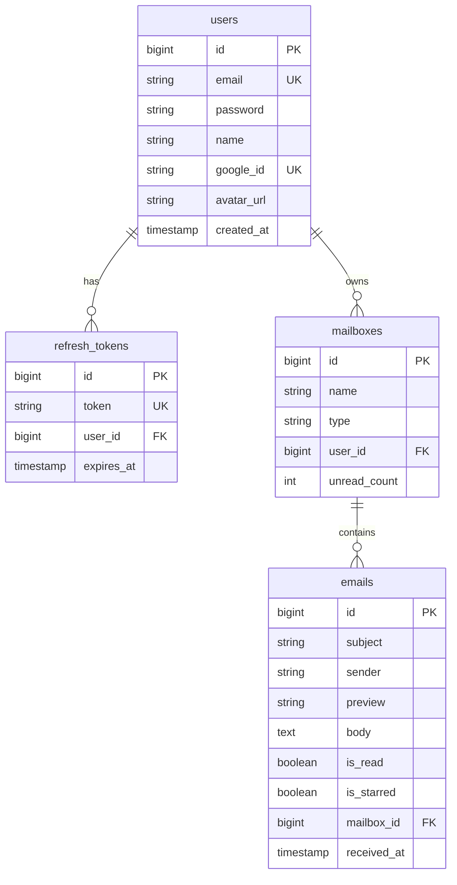

# GA03 - React Authentication (Email + Password + Google Sign-In) + Email Dashboard Mockup

## A. Overview

Build a React single-page application that implements secure authentication using **email + password** and **Google Sign-In (OAuth)**. After authentication, users land on an **email dashboard** composed of three columns (folders / mailbox list, email list, email detail). The goal is to demonstrate a complete client-side authentication flow (login, token handling, refresh, logout) plus a polished, functional UI mockup for a post-login email dashboard.

---

## B. Objectives

- Implement email/password login and Google Sign-In integration.
- Understand access tokens vs refresh tokens and secure client handling.
- Configure API communication with token attachment and refresh mechanisms.
- Manage authentication and protected data fetching efficiently.
- Implement form handling and validation for authentication.
- Create protected routes and UI that requires authentication.
- Design and implement a 3-column email dashboard mockup showing realistic interactions.
- Deploy the finished app to a public hosting platform (Netlify, Vercel, Firebase Hosting, etc.) and include the public URL in the README.

---

## C. Requirements

### I. Authentication Flow

#### 1. Email + Password login:

  - Login page with email and password inputs and client-side validation.
  - On successful login, the server responds with an **access token** and a **refresh token**.

#### 2. Google Sign-In:

  - Implement Google Sign-In using OAuth. The app must accept a Google credential/token from the front end and exchange it with your backend (or mock API) for the app's access and refresh tokens.
  - Handle the UI flows for: first-time Google login (create user), returning user, and error states.

#### 3. Token Usage:

  - Use the access token to authorize protected API requests (Authorization: Bearer).
  - Use the refresh token to obtain new access tokens when the access token expires.

### II. Token Management

  - Store **access token** in-memory for the session.
  - Store **refresh token** in persistent storage (e.g., `localStorage`). Provide a short justification in the README for this choice.
  - On logout, clear both tokens and redirect to the login screen.
  - If refresh fails (expired/invalid refresh token), force logout and redirect to login.

### III. API Communication

  - Configure an API client with token attachment and automatic refresh on unauthorized responses.
  - Handle concurrency so multiple simultaneous failed requests trigger only one refresh call.

### IV. Data Management

  - Use appropriate state management for login, logout, and data fetching.
  - Ensure protected resources (e.g., mailbox folders, email list, email details) can only be accessed with valid tokens.

### V. Forms

  - Implement client-side validation and error handling for authentication forms.
  - Show inline validation errors and server-side authentication errors.

### VI. Protected Routes

  - Implement route protection (e.g., `PrivateRoute` component) that redirects unauthenticated users to `/login`.
  - After login, redirect the user to `/inbox` (the 3-column dashboard).

### VII. User Interface — Login / Auth Screens

  - `/login` — email/password fields, "Sign in with Google" button, link to Sign Up (optional).
  - Show loading indicators and error messages for failed authentication.

### VII. User Interface — Email Dashboard Mockup (after login)

Implement a responsive three-column layout for `/inbox` (desktop first; responsive collapse for small screens):

#### Column 1 — Mailboxes / Folders (Left, narrow, ~20%)

  - Vertical list: Inbox (with unread count), Starred, Sent, Drafts, Archive, Trash, Custom folders.
  - Each folder is a selectable item; selecting a folder updates the middle column's email list.

#### Column 2 — Email List (Center, ~40%)

  - Shows a paginated or virtualized list of emails for the selected folder.
  - Each email row includes: sender name, subject (single-line ellipsis), short preview (single-line), timestamp, star/important indicator, checkbox for selection.
  - Allow selecting an email to open it in the detail pane.
  - Provide basic actions above the list: Compose (opens modal), Refresh, Select All, Delete, Mark Read/Unread.

#### Column 3 — Email Detail (Right, ~40%)

  - Shows the full email: from, to, cc, subject, received date/time, body (rendered HTML/plain), attachments (if any) with download buttons.
  - Action buttons: Reply, Reply All, Forward, Delete, Mark as Unread, Toggle Star.
  - If no email is selected, show an empty state mockup: "Select an email to view details".

#### UI Requirements & Accessibility

  - Include keyboard accessibility for email navigation.
  - Responsive fallback: on small screens, show either list or detail (with a back button) instead of three columns.
  - Provide modest styling — readable typography, spacing, and clear affordances.

---

## D. Mock Email API (Required)

Use a **mocked API** for all email-related endpoints. The authentication endpoints can be real or mocked, but the email dashboard must consume mock data only.
You may use static JSON files, a mock API library, or a local mock server to simulate the following endpoints:

  - `GET /mailboxes` — list mailboxes (Inbox, Sent, etc.)
  - `GET /mailboxes/:id/emails` — list emails in a mailbox (support pagination or basic filtering)
  - `GET /emails/:id` — get email detail
  - `POST /mailboxes/seed` (Helper) — generate dummy data (folders & emails) for the current user.

The mock API should return realistic sample data, such as sender name, subject, preview text, timestamps, and message body.

---

## E. Deliverables

1. Source code of the React application in a public Git repository.
2. A `README.md` containing:
  	- Setup and run instructions.
  	- Public hosting URL and how to reproduce the deployment locally.
  	- Explanation of token storage choices and security considerations.
  	- Any third-party services used (Google OAuth client, hosting provider).
3. Screenshots or a short walkthrough GIF showing the login flow and the 3-column dashboard.

---

## F. Evaluation Criteria

  - **Authentication logic & correctness — 30%**
		Email/password and Google Sign-In implemented correctly, tokens used for protected calls.
  - **Token refresh & API handling — 20%**
		Proper request/response logic, automatic refresh, and concurrency handling.
  - **Mock email API integration — 15%**
		Mock data endpoints implemented and consumed properly.
  - **Form handling & validation — 10%**
		Input validation, feedback, and error handling.
  - **Public hosting & deployment — 10%**
		App deployed and accessible; README includes the public URL.
  - **UI / UX & mockup fidelity — 10%**
		Clear, usable 3-column dashboard with required features.
  - **Error handling & code organization — 5%**
		Graceful handling of token expiry, failed refresh, network errors; modular code.

---

## G. Stretch Goals (Optional)

  - Silent token refresh before expiration (proactive refresh).
  - Store refresh token in HttpOnly cookie instead of localStorage and justify implementation.
  - Multi-tab logout sync (BroadcastChannel or storage events).
  - Offline-capable mailbox caching with stale-while-revalidate pattern.
  - Role-based access control (different UIs for standard vs admin users).

---

## H. Submission

  - Provide a link to your Git repository and the public deployed URL.
  - Include any setup scripts and a short video or GIF demonstrating: login (email), login (Google), token refresh (simulate expiry), logout, and the 3-column email dashboard working.

---

**Goal**: Build a secure, user-friendly, and well-documented authentication system in React with a realistic post-login email dashboard mockup that consumes a mock email API.

---

## I. Backend Implementation Details

> **Note:** This section documents how MailBoard implements GA03 requirements.

### 1. Architecture & Tech Stack

| Layer | Technology |
|-------|------------|
| **Framework** | Spring Boot 3.5.x |
| **Language** | Java 17+ |
| **Database** | PostgreSQL (NeonDB - Serverless) |
| **ORM** | Spring Data JPA + Hibernate |
| **Migration** | Flyway |
| **Security** | Spring Security 6 + JWT |
| **Build Tool** | Maven |
| **API Format** | RESTful JSON (`ApiResponse<T>`) |

### 2. Key Files & Directories

| Path | Description |
|------|-------------|
| `src/main/java/.../shared/config/security/` | JWT Filter, Security Config, Entry Point |
| `src/main/java/.../shared/dto/response/ApiResponse.java` | Standardized API response wrapper |
| `src/main/java/.../shared/exception/` | Global Exception Handler, ErrorCode enum |
| `src/main/java/.../modules/auth/` | Auth Controller, Service, DTOs (Login, Register, Google) |
| `src/main/java/.../modules/user/` | User Entity, Repository, Controller |
| `src/main/java/.../modules/email/` | Email/Mailbox entities, services, controllers |
| `src/main/resources/application.yaml` | App configuration (uses env variables) |
| `.env` | Environment variables (DB, JWT secrets, Google OAuth) |

### 3. API Endpoints

#### Authentication (`/api/v1/auth`)

| Method | Endpoint | Description | Auth |
|--------|----------|-------------|------|
| `POST` | `/register` | Register new user | No |
| `POST` | `/login` | Login with email/password | No |
| `POST` | `/google` | Login with Google ID Token | No |
| `POST` | `/refresh` | Refresh access token | No |
| `POST` | `/logout` | Invalidate refresh token | Yes |

#### User (`/api/v1/users`)

| Method | Endpoint | Description | Auth |
|--------|----------|-------------|------|
| `GET` | `/me` | Get current user profile | Yes |
| `PUT` | `/me` | Update current user profile | Yes |
| `GET` | `/{id}` | Get user by ID | Yes |

#### Mailbox (`/api/v1/mailboxes`)

| Method | Endpoint | Description | Auth |
|--------|----------|-------------|------|
| `GET` | `/` | List all mailboxes for current user | Yes |
| `POST` | `/seed` | Generate dummy mailboxes and emails | Yes |
| `GET` | `/{id}/emails` | List emails in mailbox (paginated) | Yes |

#### Email (`/api/v1/emails`)

| Method | Endpoint | Description | Auth |
|--------|----------|-------------|------|
| `GET` | `/{id}` | Get email detail | Yes |

### 4. Database Schema

### 5. Testing

- **Postman Guide**: See [ga03-postman-guide.md](../guides/postman/ga03-postman-guide.md) for detailed API testing instructions.
- **Auto Token Scripts**: Login/Logout scripts included in Postman collection for automatic token management.
- **Google OAuth Testing**: Requires Google OAuth Playground setup with project credentials.

### 6. Environment Variables

| Variable | Description |
|----------|-------------|
| `DB_URL` | PostgreSQL connection string |
| `DB_USERNAME` | Database username |
| `DB_PASSWORD` | Database password |
| `JWT_SECRET` | Secret key for signing JWTs |
| `JWT_ACCESS_EXPIRATION` | Access token TTL (ms) |
| `JWT_REFRESH_EXPIRATION` | Refresh token TTL (ms) |
| `GOOGLE_CLIENT_ID` | Google OAuth Client ID |
| `GOOGLE_CLIENT_SECRET` | Google OAuth Client Secret |
| `CORS_ALLOWED_ORIGIN_1` | Allowed frontend origin |
