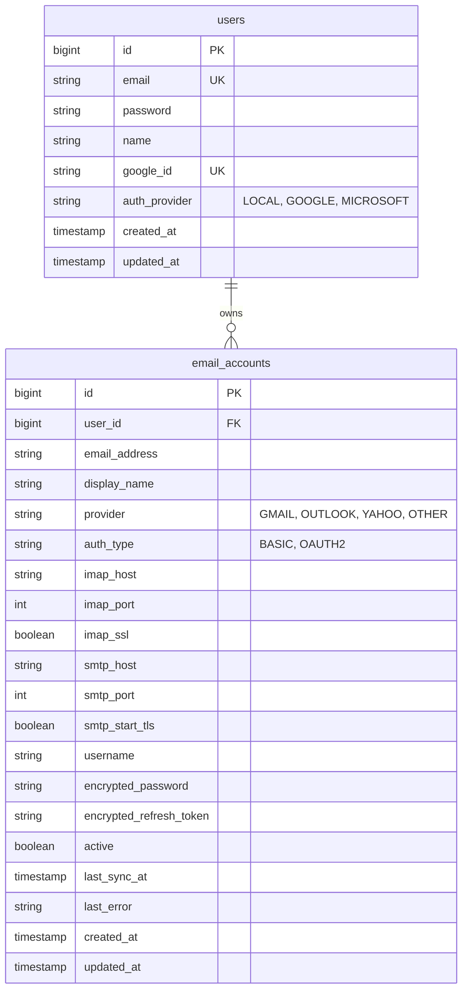

# GA04 - React Email Client with Gmail / IMAP/POP3 Integration

## A. Goal

Build the React SPA from the original assignment and add one of these real-mailbackends:

  - **Track A — Gmail API (recommended)**: Use Google OAuth2 to access a user’s Gmail via the Gmail REST API (read/send/labels/watch).

  - **Track B — IMAP / POP3**: Implement a backend that connects to user mailservers via IMAP (preferred) or POP3 using credentials or OAuth2 (where available), and provides a protected API the React app consumes.

Students must demonstrate secure authentication, correct token handling (or credential usage), and a working inbox that shows real messages, message detail, and basic mailbox actions (reply, delete, mark read, attachments).

---

## B. Objectives (what the student will learn)

- Implement secure OAuth2 flows (Google) and/or server-side IMAP/POP3 access.
- Differentiate access token vs refresh token; implement safe storage & refresh.
- Build a robust API client with automatic token refresh and concurrency protection.
- Map real mailbox concepts (labels/folders, threads) into a responsive 3-column UI.
- Handle attachments, message bodies (HTML/plain), pagination, and search/filter.
- Understand security tradeoffs: Where to store tokens, how to avoid leaking credentials.
- Deploy both frontend and backend; document setup steps.

---

## C. Requirements — high level

### I. Architecture constraints

- The React frontend remains a SPA (same /login, /inbox routes).
- A backend is required for real integrations:
	- For **Gmail**: backend exchanges Google credential for server-side tokens, stores refresh token securely, proxies Gmail API calls to the frontend (or issues scoped app tokens).
	- For **IMAP/POP3**: backend connects to IMAP/POP3 servers (using TLS), and presents a REST API to the frontend (GET /mailboxes, GET /mailboxes/:id/emails, GET /emails/:id, POST /emails/:id/send, etc.). The frontend must use the same protected API patterns as the mock assignment.

- The email dashboard UI must function identically to the mock spec (3 columns, actions, accessibility, responsive behavior). Real data must populate it.

### II. Authentication

- Keep the original email+password login & Google Sign-In mock or real for app users (you may reuse the previous mock auth).
- **Important**: For Gmail track, implement full **Google OAuth2 Authorization Code flow** (not just client-side token), with the backend exchanging the code for tokens. Frontend should never store Google refresh tokens directly.
- For IMAP track, the backend may accept either:
	- user mail credentials (username/password) submitted securely and used only server-side, **or**
	- OAuth2 tokens (e.g., XOAUTH2 for Gmail/Outlook) if the provider supports it.

### III. Token storage & security

- **Access token**: keep in-memory on frontend; attach as `Authorization: Bearer <token>` to protected API calls.

- **Refresh token / mail credentials: must be stored server-side** in a secure datastore (or as HttpOnly, Secure cookie if you implement cookie approach). If you must persist something client-side, justify it explicitly in README (and avoid storing long-lived secrets in localStorage).

- On logout, clear all tokens server-side and client-side; revoke OAuth refresh tokens where possible.

### IV. Gmail-specific details (Track A)

- Required OAuth scopes (examples to request):
	- `https://www.googleapis.com/auth/gmail.readonly` — read emails (minimal).
	- `https://www.googleapis.com/auth/gmail.modify` — read + modify (mark read/unread, delete, labels).
	- `https://www.googleapis.com/auth/gmail.send` — to send/reply.
	- (Optionally) `https://www.googleapis.com/auth/gmail.labels` etc.

- Backend must:
	- Implement Authorization Code flow and keep refresh tokens in a secure store.
	- Provide endpoints the frontend calls (e.g., `GET /api/mailboxes`, `GET /api/mailboxes/:id/emails?page=...`, `GET /api/emails/:id`, `POST /api/emails/send, POST /api/labels/:id/toggle`).
	- Handle token refresh server-side (use stored refresh token to get new access token) and proxy requests to Gmail API.
	- Optionally, implement Gmail Push Notifications (`watch`) for near-real-time updates (stretch).

- Frontend must:
	- Request sign-in; after Google sign-in, the backend attaches the app session tokens and the SPA proceeds to /inbox.
	- Use the app's access token for calling the backend API.

### V. IMAP / POP3 specifics (Track B)

- Prefer **IMAP** for full sync behavior; POP3 may be used for simple retrieval-only implementations.
- Backend must:
	- Connect to the IMAP server using TLS, authenticate with the user’s credentials or OAuth2 token (XOAUTH2) where supported.
	- Provide the same REST endpoints as Gmail track for a unified frontend interface.
	- Support listing mailboxes (IMAP folders), listing emails in a folder with pagination (use UID ranges or sequence numbers), fetch full message (RFC822), and basic actions: mark read/unread, delete, append (send via SMTP) or integrate SMTP for sending.
	- Handle large attachments safely (streaming to the frontend or temporary storage).
Provide clear instructions in README for how to test with common providers (Gmail via IMAP, Outlook, custom IMAP server).

### VI. Feature checklist (minimum)

- OAuth2 Google login (backend code exchange) or IMAP backend working.
- SPA login page and Google Sign-In flow integrated.
- Backend stores refresh token / mail creds securely (explain in README).
- Frontend in-memory access token, persistent refresh token only server-side / HttpOnly cookie.
- API client with automatic retry + single refresh call concurrency handling.
- 3-column email dashboard with:
	- mailbox list (labels/folders),
	- paginated/virtualized email list,
	- email detail with attachments and actions.
- Compose modal, Reply/Forward flow (send via Gmail API or SMTP).
- Keyboard navigation and responsive layout with small-screen fallback.
- Error handling: token expiry, failed refresh -> forced logout.
- README with deployment steps, security justification, Google Cloud / IMAP setup notes.

---

## D. API / Endpoint suggestions (backend)

Provide these REST endpoints so frontend stays the same across tracks:

- `POST /api/auth/login` (app credentials (optional))
- `POST /api/auth/google/callback` (receive code, exchange for tokens, create session)
- `POST /api/auth/logout`
- `GET  /api/mailboxes`
- `GET  /api/mailboxes/:id/emails?page=1&limit=50`
- `GET  /api/emails/:id`
- `POST /api/emails/:id/reply`
- `POST /api/emails/send`
- `POST /api/emails/:id/modify` (mark read/unread, star, delete)
- `GET  /api/attachments/:id` (stream attachment)

Implementation note: Backend should authenticate frontend requests (session cookie or JWT) and then proxy to Gmail or IMAP actions. Avoid letting frontend access Gmail API directly with raw Google refresh tokens.

---

## E. Concurrency & Token Refresh (must)

- The backend must centralize refresh logic for Gmail tokens (server-side refresh). If you implement frontend-managed tokens (for non-Google auth), implement concurrency guard: when multiple requests get 401, only one refresh request is in-flight; others wait and then retry with the new token.
- Provide pseudo-code or an implementation for a request queue or a refresh lock in the frontend API client.

---

## F. Testing & Demo

- Demonstrate:
	- Login (email and Google).
	- Inbox populated from a real Gmail / IMAP account.
	- Open message detail, download attachment, reply and send message.
	- Token expiry simulation: demonstrate refresh works or forced logout if refresh fails.
- Provide a short GIF or video showing these flows.

---

## G. Deployment & env

- Deploy frontend (Netlify/Vercel/Firebase).
- Deploy backend to a platform that supports secure environment variables (Heroku, Render, Railway, Cloud Run).
- **Sensitive notes**: Never commit client secrets. Use environment variables for:
	- Google OAuth client ID & secret
	- Database credentials (if storing tokens)
	- SMTP creds / IMAP creds (if using test accounts)

---

## H. Deliverables

1. GitHub repo with frontend + backend (clear monorepo or two repos).
2. README including:
	- Setup & run locally
	- Deployed public URLs (frontend + backend)
	- How to create Google OAuth credentials and set allowed redirect URIs
	- IMAP test accounts setup (if used)
	- Explanation of token storage choices & security considerations
	- How you simulated token expiry (for demo)
3. Short demo GIF or video (2–3 minutes) showing login flows and the 3-column UI.
4. Optional: Postman collection for backend endpoints and sample test account config.

---

## I. Evaluation rubric (suggested weights)

- Gmail / IMAP correctness & security — 30%
- Token handling & refresh logic (including concurrency handling) — 25%
- Backend proxy & API correctness (mailbox and email endpoints) — 15%
- Frontend UI: 3-column dashboard fidelity, accessibility — 15%
- Deployment + README + demo — 10%
- Code quality & error handling — 5%

---

## J. Stretch goals

- Implement **Gmail push notifications** (`watch` + Pub/Sub) to update inbox in real time.
- Use **IMAP IDLE** for live updates instead of polling.
- Store refresh tokens in **HttpOnly Secure cookies** and justify the choice (CSRF protections).
- Implement **multi-tab logout sync** using BroadcastChannel.
Add offline caching (IndexedDB) + stale-while-revalidate for emails.

---

## K. Grading examples / acceptance criteria (concrete)

- When reviewer logs in via Google, the app shows real Gmail folders and messages from that user’s inbox (not mock data).
- Clicking a message opens full detail, attachments downloadable, reply sends message to recipient.
- If access token expires, the app continues working because backend refreshed token using stored refresh token; no manual re-login needed (unless refresh token invalid).
- If refresh token is revoked/expired, the app forces logout and clears stored tokens.

---

## L. Quick implementation tips for students

- For Gmail: use Google’s OAuth2 Authorization Code flow with `offline` access to receive a refresh token.
- Use `imap-simple` or node-imap on Node backends for IMAP, and `nodemailer` (SMTP) to send messages.
- Parse message bodies with `mailparser` to handle attachments and HTML/plain variants.
- Virtualize long lists with `react-window` or similar.
- For concurrency guard on frontend API client: maintain a `refreshPromise` variable; if a 401 occurs and `refreshPromise` exists, await it instead of issuing another refresh.

---

## M. Backend Implementation Details (Track B)

> **Note:** This section documents how MailBoard implements GA04 requirements.

### 1. Architecture & Tech Stack

| Component | Technology |
|---|---|
| Backend | Spring Boot 3 + Jakarta Mail (IMAP/SMTP) |
| Database | PostgreSQL (Flyway migrations) |
| Security | AES-256-GCM credential encryption, JWT auth |
| API Style | REST with unified `/api/v1/email-accounts/*` endpoints |

### 2. Restricted Social Mode

MailBoard implements a **simplified authentication strategy**:

| Login Method | Email Account Linking |
|---|---|
| **Local (Email/Password)** | ✅ Can link multiple accounts (Gmail, Outlook, Yahoo) |
| **Google OAuth** | ❌ Cannot link additional accounts (403 Forbidden) |
| **Microsoft OAuth** | ❌ Cannot link additional accounts (Future) |

**Rationale:** This simplifies the UX for casual users (one-click Google login = one inbox) while keeping power-user flexibility for those who register locally.

### 3. Key Files

| File | Purpose |
|---|---|
| `EmailAccountController.java` | REST endpoints for IMAP/SMTP operations |
| `ImapService.java` | IMAP connection, folder/message fetching |
| `SmtpService.java` | Email sending via SMTP |
| `EncryptionService.java` | AES-256-GCM for credential storage |
| `AuthProvider.java` | Enum: LOCAL, GOOGLE, MICROSOFT |
| `V3__create_email_accounts_table.sql` | DB schema for linked accounts |
| `V4__add_auth_provider_to_users.sql` | DB migration for auth provider tracking |

### 4. API Endpoints

| Method | Endpoint | Description |
|---|---|---|
| POST | `/email-accounts/connect` | Link new account (Local users only) |
| GET | `/email-accounts` | List linked accounts |
| DELETE | `/email-accounts/{id}` | Disconnect account |
| GET | `/email-accounts/{id}/folders` | List IMAP folders |
| GET | `/email-accounts/{id}/folders/{folder}/messages` | List messages (paginated) |
| GET | `/email-accounts/{id}/folders/{folder}/messages/{uid}` | Full message detail |
| POST | `/email-accounts/{id}/send` | Send email via SMTP |
| PATCH | `/email-accounts/{id}/folders/{folder}/messages/{uid}/read` | Mark read/unread |
| GET | `/email-accounts/{id}/folders/{folder}/messages/{uid}/attachments/{id}` | Download attachment |

### 5. Database Schema

### 6. Testing

See [ga04-postman-guide.md](../guides/postman/ga04-postman-guide.md) for detailed Postman testing instructions.

### 7. Environment Variables

| Variable | Description |
|----------|-------------|
| `ENCRYPTION_AES_KEY` | 32-byte Base64 key for AES-256-GCM credential encryption |
| `DB_URL` | PostgreSQL connection string |
| `DB_USERNAME` | Database username |
| `DB_PASSWORD` | Database password |
| `JWT_SECRET` | Secret key for signing JWTs |
| `GOOGLE_CLIENT_ID` | Google OAuth Client ID (for Google Login) |
