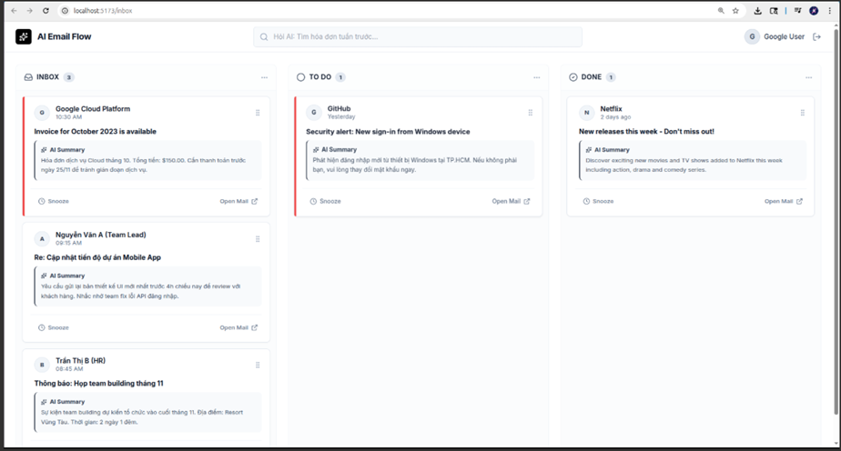

# GA05 – Kanban-Based Email Workflow Interface

## A. TL;DR
From our perspective, we are not focusing on building a standard Email Client (e.g., displaying content, replying), as **Gmail** handles this perfectly. It makes no sense to replicate existing features. Instead, we are focusing on the **AI aspects**, specifically **summarization** and **semantic search** to retrieve relevant emails. Therefore, the UI can simply look like this:

We can integrate this view by implementing a toggle button to switch between the traditional model (from Week 1) and the Kanban mode **(Optional)**.

---

## B. Project Requirements

### I. Kanban Interface Visualization

**Description:** Develop a web interface that organizes email data into a Kanban board layout.
- _Suggested Columns (Examples only, not mandatory)_: Inbox, To Do, In Progress, Done, or Snoozed.

**Definition of Done:**
- The interface renders the Kanban board with distinct columns based on the system configuration.
- Each email is represented as a "Card" within a column.
- Each Card displays real email data fetched from the backend (e.g., Sender, Subject, and a summary of the Body).

### II. Workflow Management (Drag-and-Drop)

**Description:** Implement drag-and-drop functionality to allow users to intuitively manage email workflows by moving Cards between columns.

**Definition of Done:**
- Users can drag a Card from its current column to any other active column.
- Dropping a Card triggers a state change in the backend to reflect the email's new status (e.g., moving from "Inbox" to "Done").
- The UI updates immediately to reflect the new position of the Card without requiring a full page refresh.

### III. Snooze / Deferral Mechanism

**Description:** Develop a Snooze feature that allows users to temporarily remove an email from the immediate workflow until a specific condition is met (e.g., a specific time or date).

**Definition of Done:**
- Users can select a "Snooze" option for a Card (e.g., via a button or by dragging to a specific area).
- Upon action, the Card is hidden from the main active view (e.g., removed from "Inbox") and moved to a "Snoozed" state or column.
- The system implements logic to monitor the snooze duration.
- Once the snooze period expires, the system automatically restores the Card to its original context (e.g., returning it to the "Inbox").

### IV. Content Summarization Integration

**Description:** Implement a feature that generates concise summaries of the real email content provided by the backend. This should replace reading long email bodies for quick decision-making.

**Definition of Done:**
- The system processes this email content (e.g., via an integration with an LLM API like OpenAI/Gemini or a text processing library) to generate a summary.
- The API returns a meaningful, generated summary (not hardcoded text).
- The Kanban Card displays this summary directly on its face, allowing the user to click on the card to view the detailed email then navigate to the original Gmail link (suggested) or the detailed view from Week 1.

---

## C. Grading example

<table>
  <tr>
    <th>Feature</th>
    <th>Grading Criteria</th>
    <th>Max Score</th>
  </tr>
  <tr>
    <td><b>I</b></td>
    <td>
      • The interface renders the board with distinct columns (flexible configuration allowed, e.g., Inbox, To Do, Done). 
      • Cards display <b>real</b> email data fetched from the backend (must include Sender, Subject, and Content snippet). 
      • The layout is organized and visually readable (Kanban style).
    </td>
    <td><b>25</b></td>
  </tr>
  <tr>
    <td><b>II</b></td>
    <td>
      • Users can successfully drag a Card from one column to another. 
      • Dropping a Card triggers a Backend update to change the email's status. 
      • The UI updates the Card's position immediately without requiring a full page refresh.
    </td>
    <td><b>25</b></td>
  </tr>
  <tr>
    <td><b>III</b></td>
    <td>
			• Selecting "Snooze" correctly removes/hides the Card from the active column (e.g., Inbox). 
			• The Card is successfully moved to a "Snoozed" state or column. 
			• Logic is implemented to "wake up" (restore) the email to the active view after the simulation/time passes.
    </td>
    <td><b>25</b></td>
  </tr>
  <tr>
    <td><b>IV</b></td>
    <td>
			• The backend successfully sends real email text to a processing API (LLM or library). 
			• The system returns a dynamically generated summary (no hardcoded/mock text allowed). 
			• The summary is clearly displayed on the Card or in a detailed view.
    </td>
    <td><b>25</b></td>
  </tr>
  <tr>
    <td colspan="2"><b>Total</b></td>
    <td><b>100</b></td>
  </tr>	
</table>
