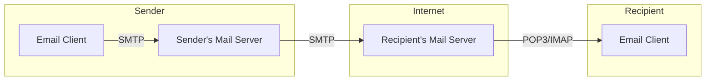
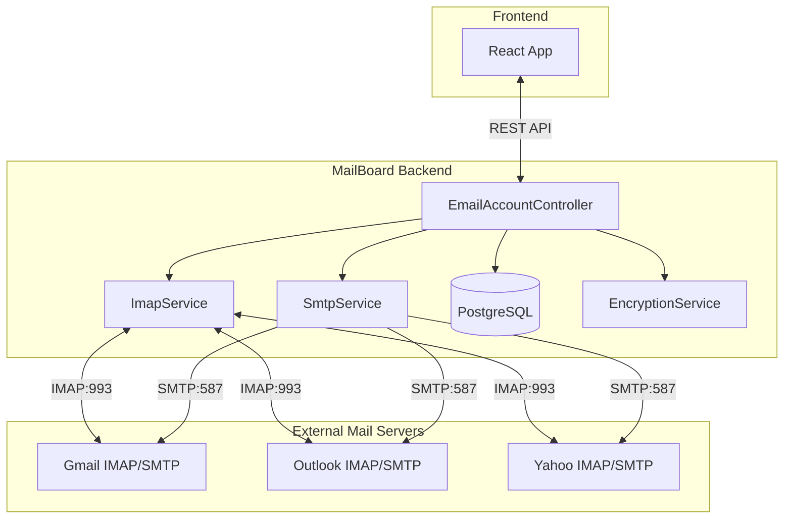

# Email Protocols: SMTP, POP3, IMAP

> Tài liệu tham khảo về các giao thức email được sử dụng trong MailBoard

## Tổng quan hệ thống Email



**Luồng hoạt động:**
1. User soạn email trên client (Gmail, Outlook, MailBoard...)
2. Client gửi email qua **SMTP** đến Mail Server của người gửi
3. Mail Server gửi email qua **SMTP** đến Mail Server của người nhận
4. Người nhận dùng **POP3** hoặc **IMAP** để đọc email từ server

---

## 1. SMTP (Simple Mail Transfer Protocol)

**Chức năng:** Gửi email từ client → server hoặc server → server

| Đặc điểm | Chi tiết |
|----------|----------|
| **Port mặc định** | 25 (server-to-server), 587 (client-to-server với STARTTLS), 465 (SSL) |
| **Hướng** | Chỉ **gửi đi** (outgoing) |
| **Bảo mật** | STARTTLS hoặc SSL/TLS |

### Workflow SMTP:

```
1. Client kết nối → SMTP Server (port 587)
2. EHLO/HELO handshake
3. AUTH LOGIN (xác thực username/password)
4. MAIL FROM: <sender@example.com>
5. RCPT TO: <recipient@example.com>
6. DATA → Gửi nội dung email
7. QUIT → Kết thúc
```

### SMTP trong MailBoard (`SmtpService.java`):

```java
// 1. Cấu hình SMTP properties
Properties props = new Properties();
props.put("mail.smtp.host", "smtp.gmail.com");
props.put("mail.smtp.port", "587");
props.put("mail.smtp.auth", "true");
props.put("mail.smtp.starttls.enable", "true");

// 2. Tạo session với xác thực
Session session = Session.getInstance(props, new Authenticator() {
    protected PasswordAuthentication getPasswordAuthentication() {
        return new PasswordAuthentication(username, password);
    }
});

// 3. Tạo và gửi email
MimeMessage message = new MimeMessage(session);
message.setFrom(new InternetAddress(from));
message.setRecipient(Message.RecipientType.TO, new InternetAddress(to));
message.setSubject(subject);
message.setText(body);

Transport.send(message);
```

---

## 2. POP3 (Post Office Protocol v3)

**Chức năng:** Tải email từ server về client

| Đặc điểm | Chi tiết |
|----------|----------|
| **Port mặc định** | 110 (plaintext), 995 (SSL) |
| **Hướng** | Chỉ **nhận về** (incoming) |
| **Mô hình** | **Download & Delete** (mặc định) |

### Đặc điểm POP3:

- ❌ **Không đồng bộ** - Email tải về 1 thiết bị, xóa khỏi server
- ❌ Chỉ hỗ trợ 1 folder (INBOX)
- ✅ Đơn giản, ít tốn tài nguyên server
- ✅ Tốt cho offline access

### Workflow POP3:

```
1. USER username
2. PASS password  
3. LIST → Xem danh sách email
4. RETR 1 → Tải email số 1
5. DELE 1 → Xóa email số 1 (optional)
6. QUIT
```

> **Note:** MailBoard không sử dụng POP3 vì IMAP phù hợp hơn cho multi-device sync.

---

## 3. IMAP (Internet Message Access Protocol)

**Chức năng:** Quản lý email trực tiếp trên server

| Đặc điểm | Chi tiết |
|----------|----------|
| **Port mặc định** | 143 (plaintext), 993 (SSL/TLS) |
| **Hướng** | **Nhận về** + **Quản lý** (incoming + management) |
| **Mô hình** | **Server-side storage** |

### Đặc điểm IMAP:

- ✅ **Đồng bộ nhiều thiết bị** - Email ở trên server
- ✅ Hỗ trợ **nhiều folders** (INBOX, Sent, Drafts, custom...)
- ✅ **Partial fetch** - Chỉ tải headers trước, body khi cần
- ✅ **Flags** - SEEN, FLAGGED, DELETED, ANSWERED...
- ✅ **Search** - Tìm kiếm trên server
- ❌ Phức tạp hơn, tốn tài nguyên server

### IMAP trong MailBoard (`ImapService.java`):

```java
// 1. Kết nối đến IMAP server
Properties props = new Properties();
props.put("mail.store.protocol", "imaps");
props.put("mail.imaps.host", "imap.gmail.com");
props.put("mail.imaps.port", "993");
props.put("mail.imaps.ssl.enable", "true");

Session session = Session.getInstance(props);
Store store = session.getStore("imaps");
store.connect(host, username, password);

// 2. Mở folder
Folder inbox = store.getFolder("INBOX");
inbox.open(Folder.READ_ONLY);

// 3. Fetch messages với FetchProfile (tối ưu performance)
Message[] messages = inbox.getMessages(start, end);
FetchProfile fp = new FetchProfile();
fp.add(FetchProfile.Item.ENVELOPE);  // Headers (From, To, Subject, Date)
fp.add(FetchProfile.Item.FLAGS);     // Read/Starred status
fp.add(UIDFolder.FetchProfileItem.UID); // Unique ID
folder.fetch(messages, fp);

// 4. Đọc chi tiết email khi cần
Object content = message.getContent();
if (content instanceof Multipart) {
    // Xử lý email có attachments
    Multipart multipart = (Multipart) content;
    for (int i = 0; i < multipart.getCount(); i++) {
        BodyPart bodyPart = multipart.getBodyPart(i);
        // ...
    }
}

// 5. Thay đổi flags
message.setFlag(Flags.Flag.SEEN, true);     // Đánh dấu đã đọc
message.setFlag(Flags.Flag.FLAGGED, true);  // Star/Flag email
message.setFlag(Flags.Flag.DELETED, true);  // Xóa email

// 6. Đóng kết nối
folder.close(true);  // true = expunge deleted messages
store.close();
```

---

## So sánh POP3 vs IMAP

| Tiêu chí | POP3 | IMAP |
|----------|------|------|
| **Email lưu ở đâu?** | Client (local) | Server |
| **Multi-device sync** | ❌ Không | ✅ Có |
| **Folders** | Chỉ INBOX | Nhiều folders |
| **Bandwidth** | Tải toàn bộ | Tải theo yêu cầu |
| **Offline access** | ✅ Tốt | ⚠️ Cần cache |
| **Use case** | Single device, archival | Multi-device, cloud-like |

---

## 4. Các giao thức/cơ chế bổ sung

### XOAUTH2

Thay thế username/password bằng **OAuth2 Access Token**:

```java
// Cấu hình XOAUTH2 cho Gmail
props.put("mail.imaps.auth.mechanisms", "XOAUTH2");
props.put("mail.imaps.sasl.enable", "true");
props.put("mail.imaps.sasl.mechanisms", "XOAUTH2");

// Password chính là access token
store.connect(host, email, accessToken);
```

**Ưu điểm:**
- An toàn hơn (không lưu password)
- Có thể revoke access bất cứ lúc nào
- Gmail, Outlook yêu cầu cho apps mới

### IMAP IDLE

**Push notifications** - Server thông báo khi có email mới:

```java
// Thay vì polling (check liên tục)
while (true) {
    folder.idle();  // Block cho đến khi có thay đổi
    // Xử lý email mới
}
```

**Ưu điểm:**
- Real-time notifications
- Tiết kiệm tài nguyên (không cần polling)

### MIME (Multipurpose Internet Mail Extensions)

Định dạng nội dung email phức tạp:

```
Content-Type: multipart/mixed; boundary="----=_Part_1"

------=_Part_1
Content-Type: text/plain
Hello World!

------=_Part_1
Content-Type: application/pdf
Content-Disposition: attachment; filename="document.pdf"
[Base64 encoded content]

------=_Part_1--
```

---

## 5. Kiến trúc trong MailBoard



### Các thành phần:

| Component | Protocol | Chức năng |
|-----------|----------|-----------|
| `SmtpService.java` | SMTP | Gửi email |
| `ImapService.java` | IMAP | Đọc/quản lý email |
| `EncryptionService.java` | - | Mã hóa credentials AES-256-GCM |
| `EmailAccountController.java` | REST | API endpoints cho frontend |

---

## Cấu hình mặc định cho các provider

| Provider | IMAP Host | IMAP Port | SMTP Host | SMTP Port |
|----------|-----------|-----------|-----------|-----------|
| Gmail | imap.gmail.com | 993 (SSL) | smtp.gmail.com | 587 (TLS) |
| Outlook | outlook.office365.com | 993 (SSL) | smtp.office365.com | 587 (TLS) |
| Yahoo | imap.mail.yahoo.com | 993 (SSL) | smtp.mail.yahoo.com | 587 (TLS) |

> **Lưu ý:** Gmail yêu cầu **App Password** nếu bật 2FA, hoặc sử dụng OAuth2.

---

## Tham khảo

- [RFC 5321 - SMTP](https://tools.ietf.org/html/rfc5321)
- [RFC 1939 - POP3](https://tools.ietf.org/html/rfc1939)
- [RFC 3501 - IMAP4](https://tools.ietf.org/html/rfc3501)
- [Jakarta Mail Documentation](https://jakarta.ee/specifications/mail/)
